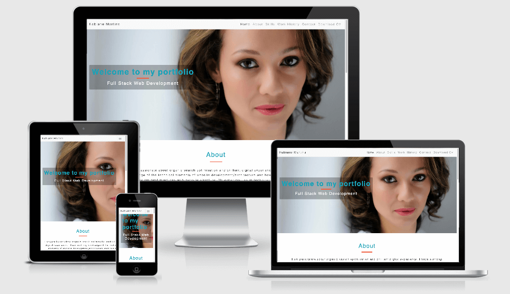

# Fabiane Martins Portfolio

Stream One Project: User-Centric Frontend Development - Code Institute 

## Overview

This is my personal portfolio website to share with prospective employers or clients my skill set and experience. The website structure was designed from top to bottom - left to right reading with the about section highligting a profile about myself, then there is a skills section, work history section and a contact form section.
The contact form gives the opportunity for direct communication, not far below in the footer there is a download CV link and social links for further information.

## Demo 

Website live demo can be found [here](https://fabiane-martins.github.io/personal-portfolio/)

## UX

This project is to target hiring managers with little time on their hands to scan through an entire CV, hence the scroll down layout and sleek and clean design. The main focus is get the user to scan all the main infomation in one page and use the contact form or social links to get in touch or download the pdf CV.

#### User stories
    - ##### First Time Visitor Goals
    a. I want to spend as little time as possible on the website.
    b. I want to learn more about the candidate and its skill set.
    c. I want information on its past experience.
    d. I want to see the candidate projects so, I will check its social media links.

    - ##### Return Visitor Goals
    
    a. I want to contact the candidate. 
    b. I want to download the CV.

    - ##### Frequent User Goals
    a. I'd like to see new projects.
    b. I'd like a blog.

#### Design
    -##### Color Scheme
    

#### Wireframes

Desktop wireframe - [view](assets/docs/desktop-framework.png)
Mobile wireframe - [view](assets/docs/mobile-framework.png)

## Features

- Home page with 5 sections linked in the nav bar as individual pages.
- Fixed nav-bar for easier user navigation regardless of where the user is located on the page.
- On mobile view the nav-bar collapses showing all the pages, once the page is selected the hamburger nav automatically closes back-up again.
- The Download CV page opens in a new tab with pdf attached for printing or download.
- Scocial link icons are on the footer as well as extra download CV function.

## Features Left to Implement

In the furture, I'd like to add JavaScript function to create a 'scrolling effect'. I also, want to have a section or an additional page with other project templates.

## Strategy

1. My goal is to have all the information in one page but separated by section within a scroll down manner.
2. A fixed nav bar is avaliable to allow users to move quickly between pages.
3. The design is clean and minimalist for an easy reading.

## Technologies Used

1. HTML5
2. CSS3
3. Bootstrap - via CDN to html doc
4. Google Fonts - import typography url to style.css sheet
5. TinyPNG - image compressor
6. PicMonkey - image resize
7. GitPod - IDE workspace
8. GitHub - project repository and hosting service

## Code Validation

1. Close Tag Checker [link](https://www.aliciaramirez.com/closing-tags-checker/)
2. W3 CSS validator [link](https://jigsaw.w3.org/css-validator/)
3. Nu HTML validator [link](https://validator.w3.org/nu/#textarea)

## Testing

As the development progressed, I tested each new feature and fixed or amended it accordingly. Once the project was finilised and I was happy with it, I tested all the function and links in different browsers.
- Tested menu bar respnsiveness on iphone, desktop and tablet.
- Tested social media lnks - this direct users to my social page in another tab.
- Tested scrow down functionality.
- Tested both header and footer donload cv feature - this opens the pdf CV in another tab.
- Tested contact form button.
- Tested code validation - no errors or warnings showing.

## Deployment

This site is hosted using GitHub pages once the master branch is deployed it will update automatically everytime commits are pushed to the repository. 
The code is written on Gitpod a cloud based editor and can be accessed via Gitpod workspace or Github [here](https://github.com/Fabiane-Martins/personal-portfolio). To download the zip file can also be found in the project directory by clicking the code button. 

## Resources

- Code Institure Course Content
- Course Slack community
- My mentor Oluwafemi Medale
- Course tutor
- Youtube videos
- W3 school website
- Bootstrap documentation
- CSS tricks website

## Credits

#### Content

All content in this portfolio website was written by myself.

#### Media

Banner image is an image of myself owned by me. The background image in the skills section were taken from [unsplash](https://unsplash.com/images/stock), free stock-photo library. 

#### Code Snippets

[Code Institute Course Content](https://courses.codeinstitute.net/)
[Bootstrap](https://getbootstrap.com/)

#### Acknowledgements

- I'll give thanks to my mentor, Oluwafemi Medale for mentoring me on the processes of designing to create this website as well as me ntoring me on the best practises and tool to approach.
- The slack community, in special Jim Morel, #user-centric-frontend lead channel for being tireless and efficient in aswering the many questions I've posted on the forum. 
- To my fiancee, for all love and support in encoraging me on the many times I wanted to give up. 
- Friends and families for the projects they have lined-up for me - this certainly helps me keep going.