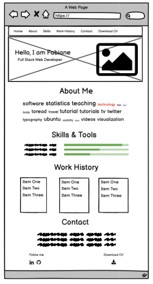

# Fabiane Martins Portfolio

Stream One Project: User-Centric Frontend Development - Code Institute 

## Overview

This is my personal portfolio website to share with prospective employers or clients my skills set and experience. The website structure was designed top from to bottom - left to right reading with the about section highligting a profile about myself, follow there is a skills section, work history section and contact form section.
The contact form gives the opportunity for direct communication, not far below in the footer there is a download CV link and social links for further information.

## Demo 

Website live demo can ve found [here](https://fabiane-martins.github.io/personal-portfolio/)

## UX
The project target hiring managers with little time on their hands to scan throght and intere CV, hence the scroll down layout and sleek and clean design. The main focus is get the user to scan all the main infomation in one page and use the contact form or social links to get in touch or download the pdf CV.

## Features

- Home page with 5 sections linked in the nav bar as individual page.
- Fixed nav-bar for easier user navigation regardless of which location on the page on desktop view.
- On mobile view the nav-bar collapses showing all the pages, once the page is selected the hamburger nav automatically close back-up again.
- Download CV page open in a new tab with pdf attached for printing or download.
- Scocial links icons on the footer as well as extra download CV function.

## Features Left to Implement

In the furture, I'd like to add JavaScript function to create 'scrolling effect'. I also, want to have a section or an additional page with other projects templates.

## Strategy

1. My goal is to have all the information in one page yet, separated by section within scroll down maner.
2. A fixed nav bar is avaliable to allow users to quick move between pages.
3. The design is clean and minimalist for an easy reading.

## Technologies Used

1. HTML5
2. CSS3
3. Bootstrap - via CDN to html doc
4. Google Fonts - import typography url to style.css sheet
5. TinyPNG - image compressor
6. PicMonkey - image resize
7. GitPod - IDE workspace
8. GitHub - project repository and hosting service

## Code Validation

1. Close Tag Checker [link](https://www.aliciaramirez.com/closing-tags-checker/)
2. W3 CSS validator [link](https://jigsaw.w3.org/css-validator/)
3. Nu HTML validator [link](https://validator.w3.org/nu/#textarea)

## Testing

## Deployment

This site is hosted using GitHub pages once the master branch is deployed it will update automatically everytime commits are pushed to github. 

## Credits

#### Content

All content in this portfolio website was written by me.

#### Media

Banner image is an image of myself owned by me. The background image in the skills section were taken from [unsplash](https://unsplash.com/images/stock), free stock-photo library. 

#### Code Snippets

[Code Institute Course Content](https://courses.codeinstitute.net/)
[Bootstrap](https://getbootstrap.com/)

#### Acknowledgements

- I'll give thanks to my mentor, Oluwafemi Medale for mentoring me on the processes of designing to create this website as well as me ntoring me on the best practises and tool to approach.
- The slack community, in special Jim Morel, #user-centric-frontend lead channel for being tiredless and efficient in aswering the many questions I've posted on the forum. 
- To my fiance, for all love and support in encoraging me on the many times I wanted to give up. 
- Friends and families for the projects they have lined-up for me - this certainly helps me keep going.